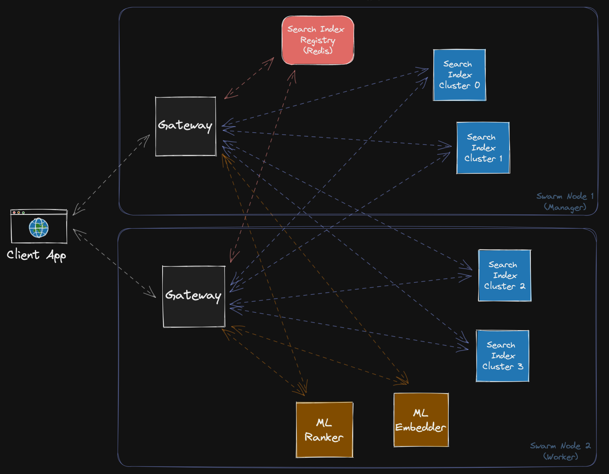
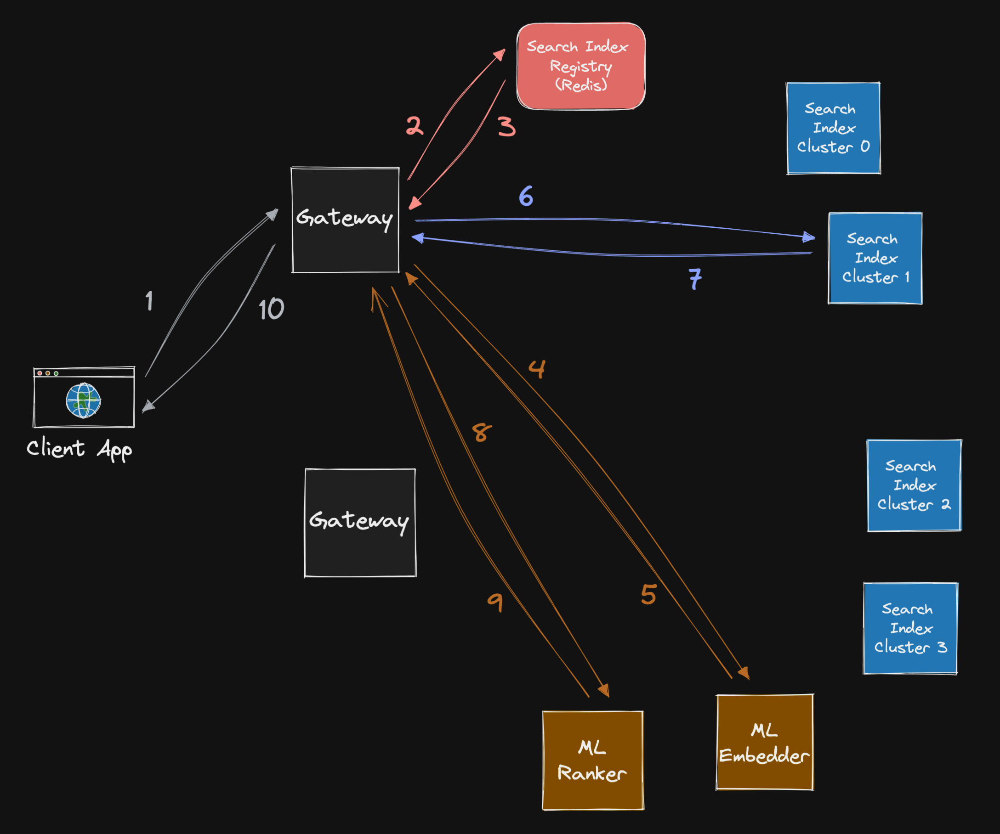
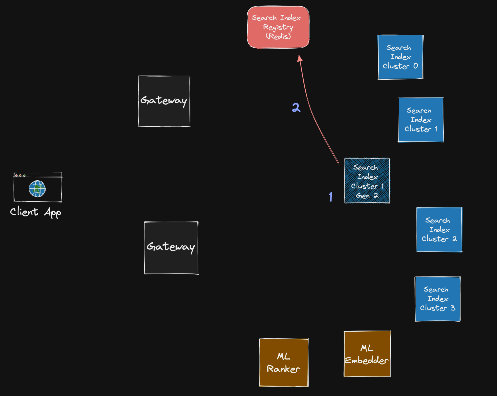
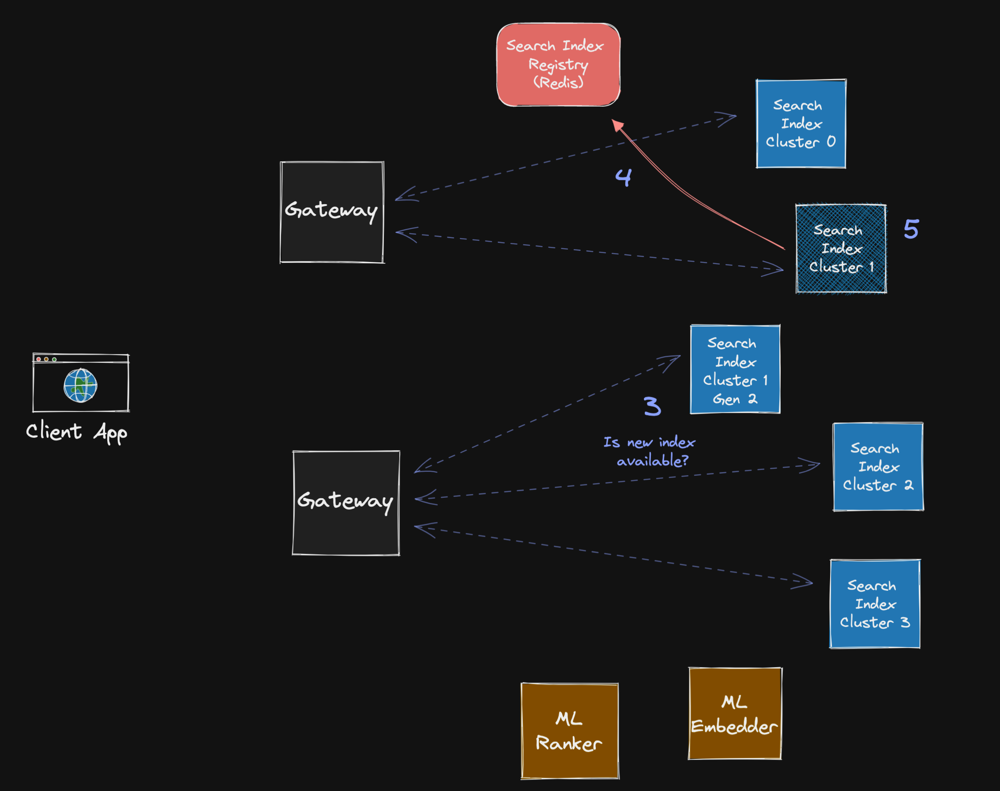

# Similar Questions Search System

A prototype of an ML-powered search system that performs document search relevant to a given query using a two-step approach.

## Introduction

Searching for relevant documents to a given query is a well-known problem in the field of machine learning and information retrieval, commonly referred to as a [Learning to rank problem](https://en.wikipedia.org/wiki/Learning_to_rank). The general approach used in these systems is called the "funnel approach":

1. An efficient and simple model is used to generate a limited set of candidate documents (e.g. 100).

2. A more accurate and heavy-duty model is applied to re-rank these candidates and select only the top few (e.g. top 5-10).

This project focuses on the implementation and deployment of the first step of the funnel approach, the search index. The search is performed using the [Quora Questions dataset](https://paperswithcode.com/dataset/quora-question-pairs), and the documents are transformed into 512-dimensional embeddings using the [Universal Sentence Encoder (USE)](https://www.tensorflow.org/hub/tutorials/semantic_similarity_with_tf_hub_universal_encoder) model. The documents are also clustered offline before serving to optimise the search performance.

## Prerequisites

To run this prototype, you will need the following:

- [`make`](https://linuxhint.com/make-command-linux/), a CLI tool used for deployment and update scenarios.
- Two or more virtual machines with Docker installed and configured as part of a Docker Swarm cluster. The host machine, used to execute make commands, must be able to access any of the swarm nodes via SSH.

## System Overview

The high-level architecture of the system is illustrated in the following diagram:



The system consists of the following components:

- **Gateway**: A service that handles all user request processing logic.
- **ML Embedder**: The embedding model.
- **ML Ranker**: The ranking model.
- **Search Registry**: A key-value registry (Redis) that holds URLs, port numbers, and cluster centers for each index.
- **Search Index Clusters**: Each cluster of documents is presented as a FAISS search index.

Each component is deployed as a Docker service in the Swarm cluster, allowing for easy maintenance, independent scalability of each component, and basic service discovery (excluding index discovery). The diagram shows how these services can be allocated on two nodes. The dashed lines represent all possible interactions.

## Preparation

#### 1. Define Environment Variables

Before launching the system, you need to define all the necessary variables in `configs/vars.env`.

- `HOSTS`: A list of comma-separated IP addresses of the nodes available.
- `SWARM_MANAGER`: The IP address of the Docker Swarm manager.
- `DOCKER_REGISTRY`: The IP address of the registry to store the docker images.
- `REDIS_HOST`, `REDIS_PORT`, `REDIS_PASSWORD`: Redis credentials and host.
- `DATA_GENERATION`, `N_CLUSTERS`: The generation of the current data snapshot and the total number of document clusters.
- `GATEWAY_PORT`, `EMBEDDER_PORT`, `RANKER_PORT`, `INDEX_PORT`: Unique ports on which each corresponding service should operate. Note that `INDEX_PORT` is used as the base value, and each new index service gets its own port assigned during deployment.

#### 2. Prepare Data Snapshot and Nodes

Additional settings for each node can be defined in `scripts/install_utils.sh`.
The data snapshot, ready to be served, can be generated from the raw data in data.misc/raw (ignored by git). Once ready, it will be delivered to each available node via `rsync`.

To prepare, execute the following command:
```bash
make prepare
```

#### 3. Build Images

Each image can be built and pushed to the docker registry by executing the following command:
```bash
make build
```

## Deployment

After building the images and preparing the nodes, you can deploy the system by executing the following command:

```bash
make deploy
```

The services will be launched in a specific sequence:

1. Embedder
2. Ranker
3. Index registry (Redis)
4. Indices
5. Gateway

The embedder and ranker are relatively independent and can be launched in any order. The index registry (Redis) will be used to store information about each index. During step 4, each index will be deployed and register itself in the registry with the following information:

```
{
    index_cluster_host: {
        "port": XXXX,
        "cluster_center": "..."
    }
}
```

This information is set to **expire** after 61 seconds and each index is expected to send a **heartbeat** every 30 seconds. This ensures that if an index becomes unavailable, it will be removed from the registry after 1 minute of inactivity. The gateway service will handle any unresponsive indices before that time.

Once all indices are up and running, the gateway service can be deployed, and the system will be ready to serve incoming requests.

## Happy Path

The following diagram provides a detailed view of the full operation:



1. The user makes a request with a question.

2-3. The gateway service checks the registry for available indices and their metadata.

4-5. The gateway service sends the raw text to the embedder service and receives an embedding in return. 

(Steps 2-3 and 4-5 can be executed in parallel)

6-7. The gateway service performs the search logic:

- If the nearest index cluster is too far away from the initial question in terms of cosine similarity, the search is not performed.
- If the nearest index cluster is close enough, the search is performed. If the search returns an empty list or the cluster is unavailable, the next available cluster is checked, and this continues until a response is obtained or there are no more clusters to check.

8-9. The gateway service sends the list of closest questions to the ranker service and receives the same list, but in a different order.

10. The final ranked list is returned to the user.

## Index Update

To initiate an update of the indices, run the following command:

```bash
make update
```

The updates are performed through a **rolling**-style update process, where each index cluster is updated one at a time. The duration of the update process, even if it takes several hours, does not cause any downtime for the system as a whole.

For each individual index cluster update, a **green/blue** deployment strategy is utilised, i.e. the new version is laucnhed first, and then the old version is shut down.

An example can be found on the following diagram:



1-2. The new version of the index cluster launches and registers itself in the index registry. 



3. The new index cluster becomes available to receive requests, and for a period of time, two similar clusters will be in production. However, this will not impact the end-user because the gateway service will simply select the closest cluster.

4-5. When the new index cluster is stable, the old one is gracefully shut down. The old cluster must remove its key from the registry, and if it fails to do so or suddenly crashes, the registry will remove the key after a maximum of 1 minute.

## Notes

#### Pros

- Docker services within a cluster are easy to maintain, scale, and configure. They have a service discovery mechanism.
- Zero downtime during updates. By updating the index clusters one by one, having both the new and old ones working together, we ensure that at least one of them is always available and user requests are not lost.
- No need for extra machines. By updating the system in a slow, rolling fashion, we can perform the updates on the same machines, without the need for new nodes.
- If anything fails during the update, the system will stop the update and continue serving user requests while any issues in the background are resolved.

#### Cons

- If the rollout does not complete due to issues, manual intervention will be required.
- Each service must have its own port, which can be slightly inconvenient to set up.
- The deployment and update scenarios are very specific and custom, making it difficult for new engineers to maintain the system.

#### Improvements

- Replace the current dummy ranker model with an actual model.
- Make the gateway service asynchronous, as it doesn't perform many computations but makes many calls to external sources.
- Add tests :)